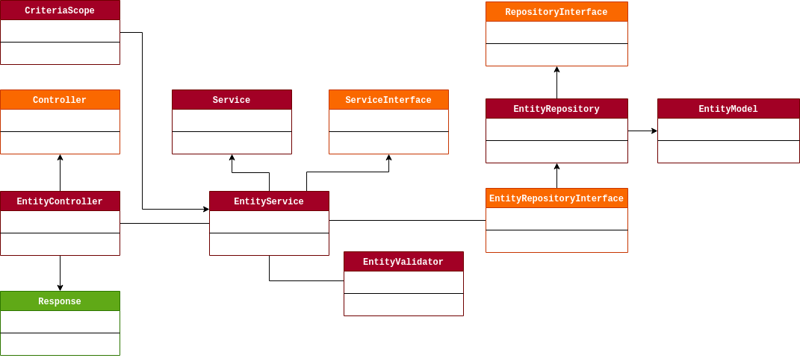

## Backend / REST API
___
### Running in localhost:
#### 1. Install dependencies
> $ composer install

#### 2. Configure the env file
> /.env

#### 3. Migrate and Seed
> $ php artisan migrate  

> $ php artisan db:seed

#### 4. Config passport to auth
> $ php artisan passport:install

#### 5. Running
> $ php artisan serve

___
### Diagram:

